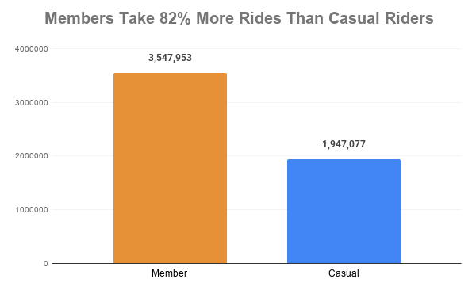
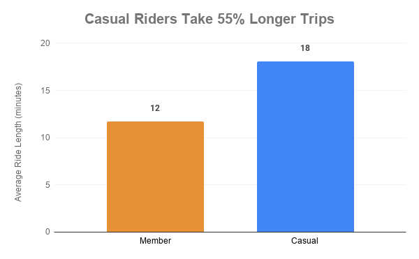
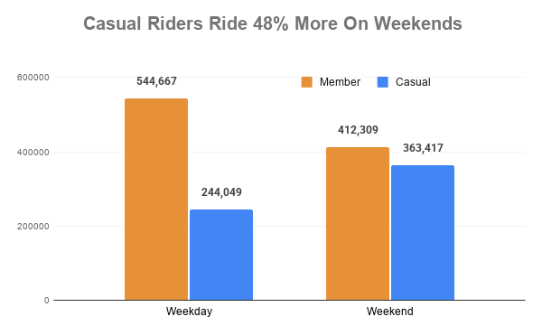
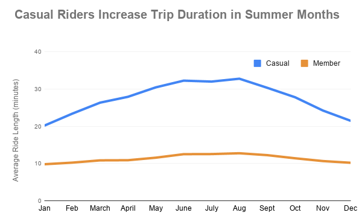

# Cyclistic Bike-Share Case Study 

## Overview 
This project analyzes 12 months of Cyclistic bike-share data to identify usage differences between casual riders and annual members to provide marketing insights to increase annual memberships. 

## Tools Used
- Python
- Pandas
- Jupyter Notebook
- Google Sheets

## Business Task 
Cyclistic's goal is to convert casual riders to members in order to maximize annual membership. This analysis examines historical bike-share data to understand how behavior differs between rider types to support marketing strategies for converting casual riders into annual members. 

## Dataset
- 12 months of Divvy/Cyclistic trip data (April 2025-March 2026)
- Public dataset provided by Divvy bike-share via City of Chicago
  
## Process 
- Consolidated and cleaned 12 monthly datasets
- Converted data types and engineered new features for analysis 
- Validated data for missing values, duplicates, consistency, and accuracy
- Removed invalid and extreme ride duration outliers 
- Formatted dataset for clarity and analysis
- Verified representation of both rider groups in final dataset
- Conducted analysis via grouped aggregations and descriptive statistics
- Created data visualizations to identify usage patterns and insights
- Developed business recommendations based on key insights

## Technical Skills Demonstrated 
- Data cleaning and processing
- Data validation and quality control
- Datetime manipulation and feature engineering
- Exploratory data analysis (EDA)
- Grouped aggregations and descriptive statistics
- Outlier detection and Boolean filtering
- Behavioral and trend analysis
- Customer segmentation analysis
- Data visualization and communication
- Business insight and recommendation development 

## Key Insights 
1. Annual members ride 82% more frequently overall 
2. Casual riders take 55% longer trips on average
3. Casual riders concentrate trips on weekends and midday with 73% higher night usage than members 
4. Members ride more consistently throughout the day, with 42% higher morning use, and concentrate usage during weekdays 
5. Usage for both rider groups peaks in summer, but casual riders increase their trip duration in the summer months 
6. Both rider types prefer electric bikes, but casual riders ride 72% longer on classic bikes 

Insights suggest that members use both bike types for functionality and for shorter, consistent, daily routine trips during the week, such as for commuting and errands. On the other hand, casual riders take longer, less frequent, leisure-oriented trips, concentrated on weekends, evenings, and in summer months, and choose classic bikes for longer trips.

## Visuals 

### Ride Frequency 

### Ride Duration

### Weekday Patterns 

### Seasonal Patterns

## Key Recommendations 
1. Promote membership to casual riders as an inexpensive and convenient means of transportation. After 10 rides, utilize notifications to show cost difference between rides and gas, and show savings per trip with a membership 
2. Run a discounted membership rate for May-August during already high casual usage to encourage routine riding during the summer
3. Promote biking as routine exercise by tracking miles ridden and offering membership discounts at milestones
4. Offer ride bundles for a certain amount of weekend night rides that can be applied to a membership
5. Promote electric bikes as eco-friendly car replacements for longer trips and encourage membership through rewards tied to frequent and longer e-bike usage
 
## Project Files 
- `Data Cleaning.ipynb` → Python cleaning notebook
- `Data Analysis.ipynb` → Python analysis notebook
- `cyclistic_case_study.pdf` → Final business report
- `visuals/` → Charts and figures used in the report

## Report
[View the Full Report](cyclistic_case_study.pdf)

